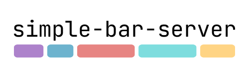

# 

A server for [simple-bar](https://github.com/Jean-Tinland/simple-bar) that enables communication with its data widgets and allow them to be refreshed or toggled with simple `curl` commands.

[Website](https://www.jeantinland.com/toolbox/simple-bar-server) • [Documentation](https://www.jeantinland.com/en/toolbox/simple-bar-server/documentation)

> [!NOTE]
> There are no external call to any API, it is just a local small node.js server on which [simple-bar](https://github.com/Jean-Tinland/simple-bar)'s components will be able to connect to via websockets.
> Check `index.js` file to see how it works.

## Features

- Refresh, toggle, enable or disable simple-bar widgets
- Refresh yabai spaces, windows, and displays simple-bar widgets
- Refresh simple-bar' skhd mode indicator
- Refresh AeroSpace spaces widget
- Refresh FlashSpace spaces widget
- Send notifications (missives) for simple-bar to display

## Installation

Clone this project anywhere on your computer:

```bash
git clone https://github.com/Jean-Tinland/simple-bar-server.git
```

You'll find the full installation guide in the [documentation](https://www.jeantinland.com/toolbox/simple-bar-server/documentation/installation/).

## Status

This project only works with the latest version of [simple-bar](https://github.com/Jean-Tinland/simple-bar). Feel free to open an issue if you find a bug or have a feature request.
